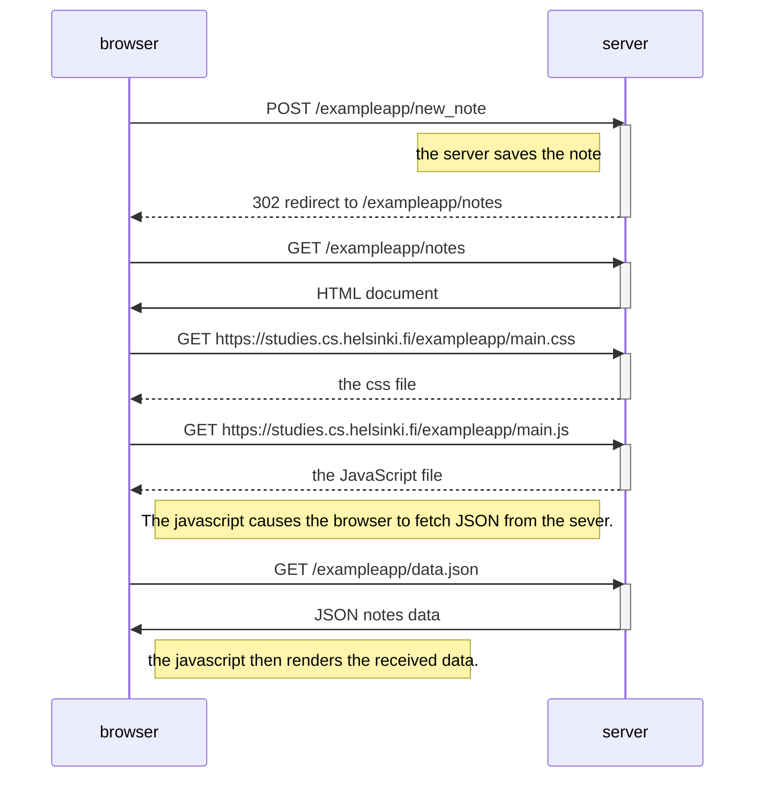

```mermaid
sequenceDiagram
    participant browser
    participant server

    browser->>server: POST /exampleapp/new_note
    activate server
    Note left of server: the server saves the note
    server-->>browser: 302 redirect to /exampleapp/notes
    deactivate server

    browser->>server: GET /exampleapp/notes
    activate server
    server->>browser: HTML document
    deactivate server

    browser->>server: GET https://studies.cs.helsinki.fi/exampleapp/main.css
    activate server
    server-->>browser: the css file
    deactivate server

    browser->>server: GET https://studies.cs.helsinki.fi/exampleapp/main.js
    activate server
    server-->>browser: the JavaScript file
    deactivate server

    Note right of browser: The javascript causes the browser to fetch JSON from the sever.

    browser->>server: GET /exampleapp/data.json
    activate server
    server->>browser: JSON notes data
    deactivate server

    Note right of browser: the javascript then renders the received data.
```
