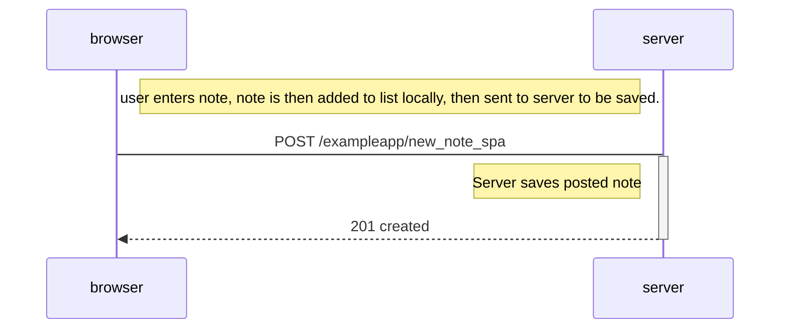

```mermaid
sequenceDiagram
    participant browser
    participant server

    Note right of browser: user enters note, note is then added to list locally, then sent to server to be saved.
    browser->server: POST /exampleapp/new_note_spa
    activate server
    Note left of server: Server saves posted note
    server-->>browser: 201 created
    deactivate server
```